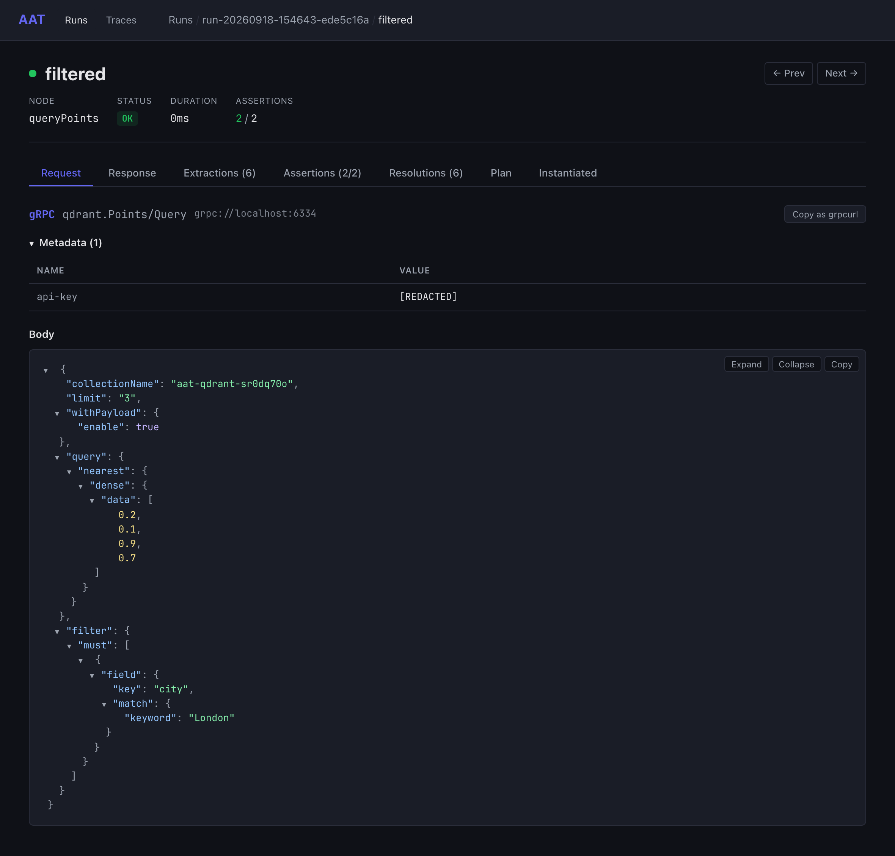
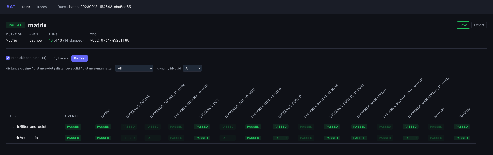
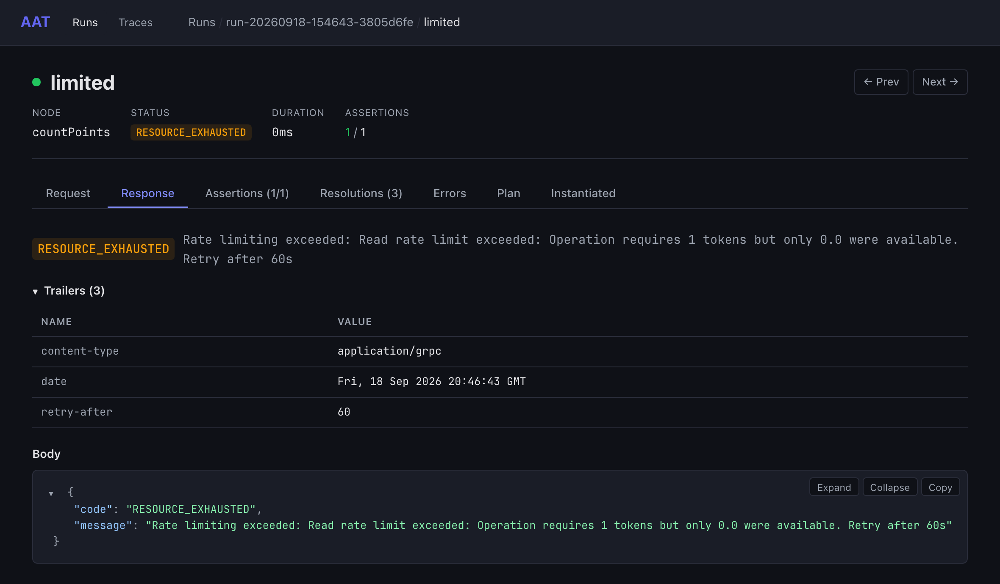

# aat-qdrant

[](https://github.com/gburgyan/aat-qdrant/actions/workflows/plans.yml)

The [Qdrant](https://qdrant.tech) vector database, driven over its gRPC API, as an
[AAT](https://github.com/gburgyan/aat) project. AAT is a command-line tool that models an API as a
graph of operations and runs long, multi-step test plans against it. This project is that graph,
its request templates, and the plans, for Qdrant v1.19.1 running in a local Docker container.
Every behavior it describes is proven by a plan that asserts it.

**Status:** all 52 public unary gRPC methods Qdrant serves, 77 nodes, 38 plans that run in about
70 seconds (60 of them one deliberate wait), 6 layers on two axes, and two plans outside the batch:
a drift finding and a cluster-only plan.

Every one of those numbers is reproducible from this repository: [CI](.github/workflows/plans.yml)
starts the pinned container and runs the batch, the layer grid, and the cluster plan on every push,
and checks the generated docs are current. It needs no secret and no account — the container is the
API, and the keys are the local ones in `compose.yaml` — so a fork runs it green without asking
anyone for anything. Each batch is uploaded as a `.aab` and the cluster run as a `.aar`, so what
Qdrant actually said opens with `aat web view <file>`.

> **Needs AAT v0.3.0 or later,** the first release with gRPC. This project is what that support was
> stress-tested against; see [How this was built](#how-this-was-built).

```
$ aat run plan query/nearest
  [1/8] create                OK  146ms
  [2/8] upsert                OK  0ms
  [3/8] nearest               OK  0ms
  [4/8] filtered              OK  0ms
  [5/8] byId (queryPoints)    OK  0ms
  [6/8] noQuery               OK  0ms
  [7/8] deprecated            OK  0ms
  [8/8] rest                 200  1ms

  cleanup:
    deleteCollection        OK  1ms

PASSED (8/8 steps, 153ms)
```

That is Qdrant's own quickstart search, asked four ways: the `Query` RPC with a vector, with a
filter, and by a point's id; the deprecated `Search` RPC; and the REST query. They agree: the three
points nearest `[0.2, 0.1, 0.9, 0.7]` are New York, Berlin, and Moscow. The collection the plan made
is gone when it ends.

`aat web view latest` opens the run in the browser. This is the `filtered` step as it was sent: the
method and the service it went to, the key as metadata, and the message in proto3 JSON, with the
query's oneof written as its member's key (`nearest`, then `dense`).



## Qdrant in brief

Qdrant is a vector database.
- An application turns each item it cares about (a document, a product, an image) into a
  *vector*: a list of numbers, usually from an embedding model, placed so that similar items land
  near each other.
- Qdrant stores those vectors and answers "which stored items are nearest to this one?" quickly.
- That is what semantic search, recommendations, and retrieval for LLM prompts run on.

Its gRPC API is three services, `qdrant.Collections`, `qdrant.Points`, and `qdrant.Snapshots`, and
the plans use them the way an application would:

| Concept | What it is | Where the plans use it |
|---|---|---|
| **Collection** | A named set of points, like a table. It fixes the vector size and the distance that defines "near": cosine, dot product, Euclidean, or Manhattan | Create, read, update, delete: [collections/lifecycle](plans/collections/lifecycle.yaml) |
| **Point** | One stored item: an id (a number or a UUID), one or more vectors, and a *payload* of JSON-like fields such as `city` or `population` | Upsert, get, scroll, count, delete: [points/upsert-and-read](plans/points/upsert-and-read.yaml) |
| **Payload index** | An index on a payload field. It makes filters fast, and faceting requires one | [points/payload](plans/points/payload.yaml), [points/indexes](plans/points/indexes.yaml) |
| **Query** | The nearest neighbours of a vector or a stored point. A query can be narrowed by a payload filter, grouped by a field, fused from several searches, or steered by "like these, unlike those" | `Query` and its batch and group forms, and the older `Search`, `Recommend`, and `Discover`: [query/nearest](plans/query/nearest.yaml) |
| **Alias** | A second name for a collection, moved atomically, so readers never see a half-built one | [aliases/blue-green](plans/aliases/blue-green.yaml) |
| **Snapshot** | A backup of one collection or of the whole store | [snapshots/collection](plans/snapshots/collection.yaml) |
| **Shard key** | In a cluster, the named group of shards a point goes to, such as a tenant or a region | [cluster/shard-keys](cluster/shard-keys.yaml) |

A typical plan follows an application's lifecycle: create a collection, upsert points, query them,
and delete the collection. The graph's cleanup deletes it even when a step fails. The data is
Qdrant's own quickstart set: six cities with four-dimensional vectors, small enough to check every
answer by hand.

## Reading it as a gRPC example

Nothing here requires caring about vectors. Qdrant makes a good gRPC specimen because its protos
use most of what real protobuf APIs use. The techniques that handle them carry over to any service
that publishes its protos: Google Cloud's APIs, etcd, Temporal, or your own.

| gRPC concern | In Qdrant | How this project handles it | Carries over to |
|---|---|---|---|
| Getting the contract | 17 published `.proto` files | Vendored unchanged and compiled once into a descriptor set ([`proto/build.sh`](proto/build.sh), `--include_imports`). `aat validate` checks every node against it, offline | Any API that publishes protos, or any server with reflection, via `grpcurl -protoset-out` |
| Writing requests | Deeply nested messages | Templates are proto3 JSON, the same text `grpcurl -d` takes, with placeholders. Validation checks each input where the message puts it | Any gRPC request |
| proto3 JSON's surprises | 64-bit ids and counts are strings; enums are names; some zero values must be sent anyway | Quoted values in templates and assertions; ordering still compares them as numbers | Every proto3 API |
| oneofs | Point ids, vectors, query kinds, the scroll cursor | Written as the member's key: `{"num": "1"}`, `{"fusion": "RRF"}` | Any API with union types |
| Maps and well-known types | Payloads are `map<string, Value>`; snapshot times are `Timestamp` | Extract paths read map keys, and stop at a `Timestamp`, which is a string | Labels, `Struct`, `Timestamp`, and `FieldMask` in Google-style APIs |
| Client-named resources | A collection is created by name, and the reply is only `true` | The name is an output echoed from the input (`fromInput`), which later steps and the cleanup read | APIs where the caller picks the id or resource name |
| Errors | Status codes with specific messages | `expectFailure: {status: [NOT_FOUND]}` plus the exact message. A status name tells apart codes that share an HTTP status | Negative tests on any gRPC service |
| Auth as metadata | An `api-key` header, or a bearer JWT | The environment's auth travels as metadata. Node-name prefixes send a different credential per step | API keys, OAuth tokens, per-tenant credentials |
| Retry hints | `RESOURCE_EXHAUSTED` with `retry-after` in the trailers | `retry: {on: [RESOURCE_EXHAUSTED]}` waits as long as the trailer asks | Rate-limited services |
| Pagination | A cursor that is a message, absent on the last page | `repeat.next` follows it (split into strings here) | List RPCs; a plain `page_token` string needs no splitting |
| One server, two protocols | The same data over gRPC and REST | A few `rest*` nodes read it back over HTTP, checked against the OpenAPI spec | gRPC services fronted by grpc-gateway or HTTP transcoding |

To start a project of your own:
1. Get a descriptor set: compile the protos with `--include_imports`, or save one from a server's
   reflection with `grpcurl -protoset-out`.
2. Give each node `proto: package.Service/Method`.
3. Write each template's `message:` as the JSON `grpcurl -d` would send.
4. Route to `grpc://` or `grpcs://`.
5. Run `aat validate --strict`, which says which paths and fields are wrong before the first call.

AAT's [gRPC guide](https://gburgyan.github.io/aat/grpc/) has the details.

## Three ways to read this project

1. **A Rosetta stone for Qdrant's gRPC API.** Every template is a working request written in
   proto3 JSON, the form grpcurl and every gRPC gateway use. The findings below say what the protos
   don't: which zero values must still be sent, where a uint64 hides in a string, and what each
   refusal says.
2. **A test suite Qdrant could run.** The plans cover the whole public gRPC surface against a
   pinned image, each asserting exact results and exact error messages, with cleanup and guards so
   nothing is left behind.
3. **A demonstration of AAT's gRPC support.** About 5,400 lines of YAML describe a 4,700-line proto
   surface. Building it led to twelve changes to AAT, each made as the gap turned up. If you came
   for gRPC rather than Qdrant, start with [Reading it as a gRPC example](#reading-it-as-a-grpc-example).

The sibling projects drive REST APIs: [aat-duffel](https://github.com/gburgyan/aat-duffel)
(flights), [aat-stripe](https://github.com/gburgyan/aat-stripe) (payments), and
[aat-shippo](https://github.com/gburgyan/aat-shippo) (shipping).

## Getting started

### What you need

- Docker with Compose v2.
- **AAT v0.3.0 or later,** the first release with gRPC. Install it with Homebrew, a release archive,
  Docker, or `go install` — see [Install](https://gburgyan.github.io/aat/install/).
- Optionally, [grpcurl](https://github.com/fullstorydev/grpcurl) to poke at the server, and protoc to
  rebuild the descriptor set.

### Run it

```bash
scripts/up.sh                               # the pinned Qdrant: REST :6333, gRPC :6334
aat validate --strict                       # graph, templates, and plans against the protos and spec
aat run batch --env local                   # every plan in plans/, guards last
aat run plan points/scroll-pages            # one plan
aat web view latest                         # the last run, in the browser

# The layer grid: two plans across four distances and two kinds of id
aat run batch matrix --layer-group distance-cosine,distance-dot,distance-euclid,distance-manhattan \
  --layer-group id-num,id-uuid --parallel 4

# Shard keys need cluster mode: a one-node cluster on :7333/:7334
scripts/up.sh cluster
aat run plan cluster/shard-keys.yaml --env local-cluster

# What the spec gets wrong (not in the batch)
aat run plan drift/deprecated-rest-search.yaml

docker compose --profile cluster down       # nothing is kept
```

### Environments

| Environment | Qdrant | Use it for |
|---|---|---|
| `local` (default) | The standalone node: gRPC `:6334`, REST `:6333` | Everything in `plans/` |
| `local-cluster` | The one-node cluster from the `cluster` profile: gRPC `:7334`, REST `:7333` | `cluster/shard-keys.yaml` |

Every node goes over gRPC except the REST cross-checks, whose names start with `rest`: `env.yaml`
routes them to the REST port. REST responses are checked against Qdrant's own OpenAPI spec, and a
response it doesn't allow fails the step.

## Nothing outlives the container

- **There is no volume.** `docker compose down` discards everything, and every `up` starts empty.
- **Everything is named for this project.** Collections are `aat-qdrant-<random>` and aliases
  `aat-qdrant-alias-<random>`. The node that creates something declares its cleanup (collections,
  aliases, snapshots, field indexes, named vectors, shard keys), so a plan that fails half way still
  removes what it made.
- **Three guards** run last in a batch and fail if anything is left: collections, aliases, and full
  snapshots. Run the batch sequentially. Under `--parallel` a guard can see a collection that
  another plan hasn't cleaned up yet.
- **The credentials guard nothing else.** `compose.yaml` and `env.yaml` share literal keys, and the
  JWTs in `env.yaml` are signed with the local key by [`scripts/mint-jwt.sh`](scripts/mint-jwt.sh).
  None of them opens anything but a container on 127.0.0.1. Never reuse them.

## Layers: one plan, every distance

A layer sets a node's inputs. The two axes here are the collection's distance and the kind of point
id:

```yaml
# layers/distance-euclid.yaml
name: distance-euclid
description: >-
  Euclidean distance: vectors are stored as written, and a lower score is nearer, so an exact match
  scores 0.
selectionHint: Collections compared by Euclid distance
inputs:
  createCollection.distance: Euclid
```

The plans in `plans/matrix/` set neither input, so a layer group reaches them.
[`matrix/round-trip`](plans/matrix/round-trip.yaml) asserts what holds in every cell of the grid:
- The collection has the distance the layer chose.
- Six points scroll back in id order, whichever kind of id they have. The UUIDs are chosen to sort
  like the numbers.
- A point is its own nearest neighbour, whether nearer means a higher score or a lower one.

Two plans across four distances and two id kinds make sixteen cells. AAT skips the combinations
that repeat another: cosine and numeric ids are the graph's defaults, so those layers repeat the
base run. The web UI shows a repeat dimmed, with the result of the run it repeats.



## What Qdrant does over gRPC

Everything in this section is something a run found. Each item names the plan that pins it. Things
seen but not asserted are marked *(observed, not asserted)*.

### Proto3 JSON, the way Qdrant's protos come out

- **A point id is a oneof,** `{"num": "1"}` or `{"uuid": "..."}`. The number is quoted because proto3
  JSON writes every 64-bit integer as a string. Zero is a valid id. Over REST the same ids are a bare
  number and a bare string —
  [points/upsert-and-read](plans/points/upsert-and-read.yaml)
- **A payload value is Qdrant's own `Value` message, not Google's.** `json_with_int.proto` forks
  `google.protobuf.Value` to add integers, and a fork gets none of the well-known type's special
  JSON. So a city is `{"stringValue": "Berlin"}` over gRPC and `"Berlin"` over REST, and a template
  writes it the first way —
  [points/upsert-and-read](plans/points/upsert-and-read.yaml), [points/payload](plans/points/payload.yaml)
- **Counts, sizes, and offsets are strings.** `pointsCount: "6"`, `count: "1"`, and the
  distance-matrix offsets are all uint64s, so equality needs the quoted form. Ordering compares
  them as numbers (`size > 0`) —
  [collections/lifecycle](plans/collections/lifecycle.yaml), [snapshots/collection](plans/snapshots/collection.yaml)
- **Some zero values must be sent anyway.**
  - A fusion query is `{"fusion": "RRF"}`: RRF is the enum's zero, sent because it is a oneof
    member.
  - The keyword index type is `FieldTypeKeyword`, also zero, and sent because the field is
    optional.

  [query/fusion](plans/query/fusion.yaml), [points/indexes](plans/points/indexes.yaml)
- **An empty list is still a list.** Each named vector comes back with `data: []` beside its dense
  vector. `data` is the deprecated field the `dense` oneof replaced, and proto3 JSON writes an empty
  repeated field rather than leaving it out —
  [points/vectors](plans/points/vectors.yaml)
- **The unnamed vector is named `""`.** Adding a named vector to a collection with one unnamed vector
  turns its config into a map keyed by vector name, with the old one under the empty key. A GJSON
  path reaches it as an empty segment: `vectors..dense.data` —
  [points/vectors](plans/points/vectors.yaml)
- **The scroll cursor is an object,** a `PointId` in `nextPageOffset`, absent on the last page —
  [points/scroll-pages](plans/points/scroll-pages.yaml)

### Collections and points

- **Qdrant names nothing for you.** Creating a collection answers `result: true` and no name; the
  name is whatever the client sent —
  [collections/lifecycle](plans/collections/lifecycle.yaml)
- **The same collection reads differently over the two protocols:**
  - over gRPC: status `Green`, size `"4"`, metadata as `Value` messages
  - over REST: `green`, `4`, and plain JSON

  [collections/lifecycle](plans/collections/lifecycle.yaml)
- **"Missing" has three different answers.**
  - Reading a missing collection is `NOT_FOUND`, or 404 over REST, with the same message.
  - Asking whether it exists is not an error: `exists` is `false`, and present in the response.
  - Deleting it succeeds with `result: false`.

  [collections/missing](plans/collections/missing.yaml)
- **A missing point is simply left out** of a read by id —
  [points/upsert-and-read](plans/points/upsert-and-read.yaml)
- **A cosine collection normalizes vectors** on the way in: `[3, 4, 0, 0]` reads back as
  `[0.6, 0.8, 0, 0]`. A dot-product collection doesn't —
  [points/cosine-normalizes](plans/points/cosine-normalizes.yaml)
- **An unwaited write is `Acknowledged`** and applied shortly after; a waited one is `Completed` —
  [points/wait-or-not](plans/points/wait-or-not.yaml)
- **The four payload operations each work differently:**
  - `SetPayload` merges keys in, and with `key` nests the values under it as a `structValue`.
  - `OverwritePayload` replaces the whole payload.
  - `ClearPayload` leaves an empty map, present in the response.

  [points/payload](plans/points/payload.yaml)
- **A collection update merges its metadata** rather than replacing it —
  [collections/update-optimizers](plans/collections/update-optimizers.yaml)
- **Refusals say exactly what is wrong.**
  - A wrong dimension is "Vector dimension error: expected dim: 4, got 2".
  - A malformed UUID is "Unable to parse UUID: not-a-uuid".
  - A point with no id is "Empty ID is not allowed".
  - All three are `INVALID_ARGUMENT`.

  [points/refusals](plans/points/refusals.yaml)

### Queries

- **Every way of asking agrees.** The `Query` RPC, the deprecated `Search`, `Recommend`, and
  `Discover` RPCs, their batch and group forms, and the REST query all give the same answers —
  [query/nearest](plans/query/nearest.yaml), [query/recommend-and-discover](plans/query/recommend-and-discover.yaml),
  [query/groups](plans/query/groups.yaml)
- **Scores are float32 and show it.** 1.362 reads back as 1.362, but 1.2218001 shows its last bits,
  so the plans assert scores as ranges —
  [query/nearest](plans/query/nearest.yaml)
- **Every request in a batch names the collection again.** Without it, Qdrant refuses the whole
  batch and names each request that left it out —
  [query/batches](plans/query/batches.yaml)
- **Faceting needs an exact-match index,** and the refusal names the field and the index to create —
  [query/facet](plans/query/facet.yaml)
- **The REST search the v1.19 spec dropped is still served.** `POST /points/search` isn't in
  `openapi.json` any more and still answers 200 —
  [drift/deprecated-rest-search](drift/deprecated-rest-search.yaml)

### Aliases, snapshots, and the cluster

- **Aliases are lenient.**
  - Creating one that exists succeeds again.
  - Deleting one that doesn't exist succeeds.
  - Reads go through an alias to its collection.

  [aliases/lifecycle](plans/aliases/lifecycle.yaml)
- **One `UpdateAliases` call switches an alias between collections atomically,** and deleting a
  collection deletes its aliases —
  [aliases/blue-green](plans/aliases/blue-green.yaml)
- **A snapshot's creation time is a `google.protobuf.Timestamp`,** an RFC 3339 string that orders
  correctly as a string. A collection's snapshots go with it, but a full snapshot outlives every
  collection —
  [snapshots/collection](plans/snapshots/collection.yaml), [snapshots/full](plans/snapshots/full.yaml)
- **A standalone node reports on its cluster but can't change it.**
  - Cluster info answers with shard 0, written as a present 0.
  - Listing shard keys answers with none.
  - Cluster setup and new shard keys are `UNIMPLEMENTED`.

  [cluster/standalone](plans/cluster/standalone.yaml)
- **On a one-node cluster, shard keys work,** and a custom-sharded collection refuses a write
  without one —
  [cluster/shard-keys](cluster/shard-keys.yaml)
- **Named dense, MaxSim multivector, and sparse vectors live side by side,** each searched with
  `using`. Leaving `using` out on named vectors is refused, naming the unnamed vector `""` —
  [vectors/kinds](plans/vectors/kinds.yaml)

### Credentials and limits

- **Two calls need no key:** Qdrant's health check and the standard gRPC health service. Qdrant's
  health service answers `SERVING` even for a service it doesn't have, where the protocol calls
  for `NOT_FOUND` —
  [health/checks](plans/health/checks.yaml)
- **Missing and wrong credentials are refused differently.** Everything else without a key is
  `UNAUTHENTICATED`, and the message tells a missing credential from a wrong one. Over REST it is
  a 401 with a plain-text body —
  [auth/keys](plans/auth/keys.yaml)
- **The read-only key is `PERMISSION_DENIED` on writes,** not `UNAUTHENTICATED`: the key is good,
  and its rights aren't —
  [auth/read-only-key](plans/auth/read-only-key.yaml)
- **A JWT does what its claims say.**
  - A token scoped to one collection lists only that collection instead of being refused.
  - It can't delete even its own collection, which needs global access.
  - An expired token is `PERMISSION_DENIED`, not `UNAUTHENTICATED`.
  - A lowercase `bearer` scheme is treated as no credential at all *(observed, not asserted)*.

  [auth/jwt](plans/auth/jwt.yaml)
- **Strict mode refuses what would be expensive.** An oversized limit and an unindexed filter are
  `INVALID_ARGUMENT`, each saying what to change. A read over the rate limit is
  `RESOURCE_EXHAUSTED` with `retry-after: 60` in the **trailers**, not the headers —
  [limits/strict-mode](plans/limits/strict-mode.yaml)
  
- **Retrying the way Qdrant asks works.** A retry rule naming `RESOURCE_EXHAUSTED` waits the
  trailer's 60 seconds, and the read then passes —
  [limits/retry-after](plans/limits/retry-after.yaml)

## How the plans fit together

```
plans/health/       the two keyless health checks
plans/collections/  create, read over both protocols, update, delete, and the three kinds of missing
plans/points/       writes, reads, ids, payloads, vectors, indexes, paging, batches, and refusals
plans/query/        every query RPC, the deprecated ones included, and the REST query
plans/aliases/      the alias lifecycle and the blue-green switch
plans/snapshots/    collection and full snapshots
plans/cluster/      what a standalone node says to cluster calls
plans/vectors/      named, multivector, and sparse vectors in one collection
plans/auth/         missing, wrong, read-only, and JWT credentials
plans/limits/       strict mode, and a retry that waits as asked
plans/matrix/       plans that layers run across the distance and id grid
plans/zz-guard/     nothing of this project's is left: collections, aliases, full snapshots
cluster/            plans for the one-node cluster (--env local-cluster), outside the batch
drift/              where Qdrant's own spec is wrong, outside the batch
```

Plans wire themselves through the graph. `upsertPoints` takes its collection from
`createCollection` by default, so most plans set only what they are testing. Credential variants
such as `readOnlyUpsertPoints` are the same node sent with another credential. `env.yaml` routes
each name prefix to that credential, and `graph.yaml` reuses the base node with a YAML merge key.

## What's exercised

Every public unary RPC, with the plan its node cites as proof:

| RPC | Node | Proven by |
|---|---|---|
| `grpc.health.v1.Health/Check` | `grpcHealthCheck` | [health/checks](plans/health/checks.yaml), and 1 other plan |
| `qdrant.Qdrant/HealthCheck` | `healthCheck` | [health/checks](plans/health/checks.yaml), and 1 other plan |
| `qdrant.Collections/CollectionClusterInfo` | `collectionClusterInfo` | [cluster/standalone](plans/cluster/standalone.yaml), and 1 other plan |
| `qdrant.Collections/CollectionExists` | `collectionExists` | [collections/missing](plans/collections/missing.yaml), and 1 other plan |
| `qdrant.Collections/Create` | `createCollection`, `createCollectionFromConfig` | [collections/lifecycle](plans/collections/lifecycle.yaml), [vectors/kinds](plans/vectors/kinds.yaml), and 33 other plans |
| `qdrant.Collections/CreateShardKey` | `createShardKey` | [cluster/shard-keys](cluster/shard-keys.yaml), and 1 other plan |
| `qdrant.Collections/Delete` | `deleteCollection` | [collections/lifecycle](plans/collections/lifecycle.yaml), and 4 other plans |
| `qdrant.Collections/DeleteShardKey` | `deleteShardKey` | [cluster/shard-keys](cluster/shard-keys.yaml) |
| `qdrant.Collections/Get` | `getCollection` | [collections/lifecycle](plans/collections/lifecycle.yaml), and 7 other plans |
| `qdrant.Collections/List` | `listCollections` | [zz-guard/no-stray-collections](plans/zz-guard/no-stray-collections.yaml), and 4 other plans |
| `qdrant.Collections/ListAliases` | `listAliases` | [zz-guard/no-stray-aliases](plans/zz-guard/no-stray-aliases.yaml) |
| `qdrant.Collections/ListCollectionAliases` | `listCollectionAliases` | [aliases/lifecycle](plans/aliases/lifecycle.yaml) |
| `qdrant.Collections/ListShardKeys` | `listShardKeys` | [cluster/standalone](plans/cluster/standalone.yaml), and 1 other plan |
| `qdrant.Collections/Update` | `updateCollection`, `updateStrictMode` | [collections/update-optimizers](plans/collections/update-optimizers.yaml), [limits/strict-mode](plans/limits/strict-mode.yaml), and 1 other plan |
| `qdrant.Collections/UpdateAliases` | `createAlias`, `deleteAlias`, `renameAlias`, `updateAliases` | [aliases/lifecycle](plans/aliases/lifecycle.yaml), [aliases/blue-green](plans/aliases/blue-green.yaml) |
| `qdrant.Collections/UpdateCollectionClusterSetup` | `updateCollectionClusterSetup` | [cluster/standalone](plans/cluster/standalone.yaml), and 1 other plan |
| `qdrant.Points/ClearPayload` | `clearPayload` | [points/payload](plans/points/payload.yaml) |
| `qdrant.Points/Count` | `countPoints` | [points/delete-and-count](plans/points/delete-and-count.yaml), and 7 other plans |
| `qdrant.Points/CreateFieldIndex` | `createFieldIndex` | [points/indexes](plans/points/indexes.yaml), and 1 other plan |
| `qdrant.Points/CreateVectorName` | `createVectorName` | [points/vectors](plans/points/vectors.yaml) |
| `qdrant.Points/Delete` | `deletePoints` | [points/delete-and-count](plans/points/delete-and-count.yaml), and 1 other plan |
| `qdrant.Points/DeleteFieldIndex` | `deleteFieldIndex` | [points/indexes](plans/points/indexes.yaml) |
| `qdrant.Points/DeletePayload` | `deletePayload` | [points/payload](plans/points/payload.yaml) |
| `qdrant.Points/DeleteVectorName` | `deleteVectorName` | [points/vectors](plans/points/vectors.yaml) |
| `qdrant.Points/DeleteVectors` | `deleteVectors` | [points/vectors](plans/points/vectors.yaml) |
| `qdrant.Points/Discover` | `discoverPoints` | [query/recommend-and-discover](plans/query/recommend-and-discover.yaml) |
| `qdrant.Points/DiscoverBatch` | `discoverBatch` | [query/batches](plans/query/batches.yaml) |
| `qdrant.Points/Facet` | `facet` | [query/facet](plans/query/facet.yaml) |
| `qdrant.Points/Get` | `getPoints` | [points/upsert-and-read](plans/points/upsert-and-read.yaml), and 5 other plans |
| `qdrant.Points/OverwritePayload` | `overwritePayload` | [points/payload](plans/points/payload.yaml) |
| `qdrant.Points/Query` | `queryPoints` | [query/nearest](plans/query/nearest.yaml), and 5 other plans |
| `qdrant.Points/QueryBatch` | `queryBatch` | [query/batches](plans/query/batches.yaml) |
| `qdrant.Points/QueryGroups` | `queryGroups` | [query/groups](plans/query/groups.yaml) |
| `qdrant.Points/Recommend` | `recommendPoints` | [query/recommend-and-discover](plans/query/recommend-and-discover.yaml) |
| `qdrant.Points/RecommendBatch` | `recommendBatch` | [query/batches](plans/query/batches.yaml) |
| `qdrant.Points/RecommendGroups` | `recommendGroups` | [query/groups](plans/query/groups.yaml) |
| `qdrant.Points/Scroll` | `scrollPoints` | [points/scroll-pages](plans/points/scroll-pages.yaml), and 2 other plans |
| `qdrant.Points/Search` | `searchPoints` | [query/nearest](plans/query/nearest.yaml) |
| `qdrant.Points/SearchBatch` | `searchBatch` | [query/batches](plans/query/batches.yaml) |
| `qdrant.Points/SearchGroups` | `searchGroups` | [query/groups](plans/query/groups.yaml) |
| `qdrant.Points/SearchMatrixOffsets` | `searchMatrixOffsets` | [query/matrix](plans/query/matrix.yaml) |
| `qdrant.Points/SearchMatrixPairs` | `searchMatrixPairs` | [query/matrix](plans/query/matrix.yaml) |
| `qdrant.Points/SetPayload` | `setPayload` | [points/payload](plans/points/payload.yaml) |
| `qdrant.Points/UpdateBatch` | `updateBatch` | [points/update-batch](plans/points/update-batch.yaml) |
| `qdrant.Points/UpdateVectors` | `updateVectors` | [points/vectors](plans/points/vectors.yaml) |
| `qdrant.Points/Upsert` | `upsertPoints` | [points/upsert-and-read](plans/points/upsert-and-read.yaml), and 28 other plans |
| `qdrant.Snapshots/Create` | `createSnapshot` | [snapshots/collection](plans/snapshots/collection.yaml) |
| `qdrant.Snapshots/CreateFull` | `createFullSnapshot` | [snapshots/full](plans/snapshots/full.yaml) |
| `qdrant.Snapshots/Delete` | `deleteSnapshot` | [snapshots/collection](plans/snapshots/collection.yaml) |
| `qdrant.Snapshots/DeleteFull` | `deleteFullSnapshot` | [snapshots/full](plans/snapshots/full.yaml) |
| `qdrant.Snapshots/List` | `listSnapshots` | [snapshots/collection](plans/snapshots/collection.yaml) |
| `qdrant.Snapshots/ListFull` | `listFullSnapshots` | [zz-guard/no-stray-full-snapshots](plans/zz-guard/no-stray-full-snapshots.yaml), and 1 other plan |

REST is used for cross-checks: `get_collection`, `get_point`, and `query_points`, validated against
the spec, and the dropped search endpoint in `drift/`.

## AAT features on display

| Feature | Where |
|---|---|
| gRPC nodes checked offline against a descriptor set, inputs where the message places them and outputs along their paths | `aat validate --strict`; every template |
| One graph, two protocols, routed by node name | `env.yaml`, the `rest*` nodes |
| An output echoed from the input the step sent | `createCollection.collectionName`, `createAlias.aliasName` |
| Cleanup declared on the node that creates, and guards | `graph.yaml`, `plans/zz-guard/` |
| Layers and layer groups | `layers/`, `plans/matrix/` |
| Status names in `expectFailure`, assertions, and retry rules | `plans/auth/`, `plans/limits/` |
| A retry that waits the `retry-after` a gRPC trailer asks for | [limits/retry-after](plans/limits/retry-after.yaml) |
| Paging with `repeat.next`, polling with `repeat.until` | [points/scroll-pages](plans/points/scroll-pages.yaml), [points/wait-or-not](plans/points/wait-or-not.yaml) |
| Iteration blocks that write an outer input into each item | `templates/queryBatch.yaml` and the other batches |
| Runtime OpenAPI validation of the REST nodes, and a drift plan | `settings.oasValidation: strict`, `drift/` |
| Generated API docs | `docs/api/`, from `aat docs generate --split` |

## How this was built

This project was built to stress-test AAT's gRPC support against an API nobody on the AAT side
wrote. Each gap it found was fixed in aat before the project went on, and all of them shipped in
v0.3.0:

| AAT commit | What changed | Found by |
|---|---|---|
| `236883d` | An output can be the input the step sent (`fromInput`) | collections: Create answers only `result: true` |
| `ecb994c` | Extract paths are checked the way gjson reads them | groundwork for the next two |
| `13b8c84` | An extract path can read a map value by its key | collections: the first read of `metadata` |
| `199e7f9` | A gRPC input is checked where the template's message puts it | collections: `vectorsConfig.params.size` |
| `a44f27b` | `fieldEquals` compares a list or an object by its structure | points: a payload read over REST |
| `30cd124` | A predicate orders a number sent as a string against a number | snapshots: `size > 0` |
| `ff779fc` | A retry rule can name a gRPC status | limits: retrying `RESOURCE_EXHAUSTED` |
| `1bf82b5` | Template inputs include a gRPC message and its metadata | review |
| `13ea3ce` | Proto names are caught at any depth, and well-known types read as JSON | review |
| `73c012d` | `aat docs generate` names a gRPC node's method | the generated docs |
| `0d1c24c` | A list or an object default reads as JSON | the MCP server's view of `upsertPoints` |
| `4d90f45` | `aat docs generate` writes the same file every time | CI's check that `docs/api` is current |

Still open: `repeat.next` takes string or integer cursors only, so Qdrant's `PointId` cursor is
split into `nextNum` and `nextUuid` ([points/scroll-pages](plans/points/scroll-pages.yaml)). And a
batch can't hold its guards until the rest have finished under `--parallel`.

## The protos and the spec

- **`proto/`:** all 17 files of `lib/api/src/grpc/proto` from `qdrant/qdrant` at tag v1.19.1
  (commit `6ab21cac18ebb6f4ae29102c7f8f5cc11affd5de`), vendored verbatim. Each file matches its
  git blob at that commit. All 17 are needed: `qdrant.proto`, the entry point Qdrant's own build
  uses, imports the internal services too.
- **`qdrant.protoset`:** built by [`proto/build.sh`](proto/build.sh) with protoc's
  `--include_imports` (libprotoc 36.1). It is 96,218 bytes, with SHA-256 `f00b3f44…6661`, and is
  reproducible byte for byte. It matches what a v1.19.1 server serves over reflection for every
  public service, apart from comments.
- **`openapi/openapi.json`:** `docs/redoc/v1.19.x/openapi.json` at the same commit (OpenAPI 3.0.1,
  516,834 bytes, SHA-256 `fdeae003…2342`). Not `master/openapi.json`, which differs inside the same
  tag.
- **The image:** `qdrant/qdrant:v1.19.1@sha256:12364fe851b9f17356fc88189fc06d1b521262e04659ec7345975b00c9246a10`.

## Point your coding assistant at it

[`.mcp.json`](.mcp.json) starts AAT's MCP server in two personas. `qdrant-api` is for integrating
with Qdrant: it describes every node's gRPC method, the metadata and message it sends, and what it
returns. `qdrant-test` is for writing and running plans. Both read this project's graph, templates,
and protos, so an assistant works from the same contract `aat validate` checks.

## Not covered yet

- **Qdrant Cloud.** The plans run against the local container. A cloud environment (`grpcs://`, a
  cluster key from the environment) is the next step.
- **Streaming and internal services.** `qdrant.StorageRead`, which holds Qdrant's only streaming RPC
  and is marked internal, and the peer-to-peer services on :6335 are left out.
- **Snapshot download, upload, and recovery,** which are REST-only.
- **Cloud inference.** Document and image queries need an inference service the open-source image
  doesn't have.
- **More than one node.** Shard transfer and replication need a real cluster.

## Repository layout

```
aat-project.yaml     the project manifest
compose.yaml         the pinned Qdrant, standalone and one-node cluster
env.yaml             routing and credentials: gRPC by default, rest* to REST, variants by prefix
graph.yaml           77 nodes, each naming its gRPC method or OpenAPI operation
templates/           one request template per adapter, 61 in all
layers/              the distance and id axes
plans/               38 plans in 12 families, guards last
cluster/ drift/      plans outside the batch
proto/               Qdrant's protos, vendored, and build.sh
qdrant.protoset      the descriptor set AAT reads
openapi/             Qdrant's OpenAPI spec, vendored
scripts/             up.sh starts the container; mint-jwt.sh signs the local JWTs
.github/workflows/   plans.yml runs everything on every push; no secret needed
docs/api/            generated: an index with the graph's diagram, and a page per node
docs/images/         the web UI screenshots above
demos/               run.sh retakes them against the local container
```

## License

Apache 2.0; see [LICENSE](LICENSE).
