# Qdrant over gRPC

77 nodes | Version 1.0.0

The Qdrant vector database, driven over its gRPC API (qdrant.Collections, qdrant.Points, qdrant.Snapshots) against a local container. A handful of REST nodes, named rest*, read the same collections back over HTTP to show what each protocol makes of the same data.

## Workflow Diagram

```mermaid
graph TD
    anonGrpcHealthCheck["anonGrpcHealthCheck<br/>grpcHealthCheck with no credential, which Qdran..."]
    anonHealthCheck["anonHealthCheck<br/>healthCheck with no credential, which Qdrant se..."]
    anonListCollections["anonListCollections<br/>listCollections with no credential, which is UN..."]
    clearPayload["clearPayload<br/>Remove every payload key from points. Proven by..."]
    collectionClusterInfo["collectionClusterInfo<br/>A collection's shards and where they live. On a..."]
    collectionExists["collectionExists<br/>Whether a collection exists. `false` is a real ..."]
    countPoints["countPoints<br/>Count points, all of them or those a filter mat..."]
    createAlias["createAlias<br/>Give a collection a second name that reads and ..."]
    createCollection["createCollection<br/>Create a collection of dense vectors. The name ..."]
    createCollectionFromConfig["createCollectionFromConfig<br/>Create a collection from a vectors config writt..."]
    createFieldIndex["createFieldIndex<br/>Index a payload field, which filters, facets, a..."]
    createFullSnapshot["createFullSnapshot<br/>Snapshot the whole storage, every collection. A..."]
    createShardKey["createShardKey<br/>Add a keyword shard key to a custom-sharded col..."]
    createSnapshot["createSnapshot<br/>Snapshot one collection. The description's crea..."]
    createVectorName["createVectorName<br/>Add a named dense vector to an existing collect..."]
    deleteAlias["deleteAlias<br/>Remove an alias, leaving its collection. Removi..."]:::cleanup
    deleteCollection["deleteCollection<br/>Delete a collection and everything in it; the c..."]:::cleanup
    deleteFieldIndex["deleteFieldIndex<br/>Drop a payload field's index; the cleanup for c..."]:::cleanup
    deleteFullSnapshot["deleteFullSnapshot<br/>Delete a full snapshot; the cleanup for createF..."]:::cleanup
    deletePayload["deletePayload<br/>Remove payload keys from points. Proven by plan..."]
    deletePoints["deletePoints<br/>Delete points, chosen either by id or by a filt..."]
    deleteShardKey["deleteShardKey<br/>Remove a shard key and its shards; the cleanup ..."]:::cleanup
    deleteSnapshot["deleteSnapshot<br/>Delete a collection snapshot; the cleanup for c..."]:::cleanup
    deleteVectorName["deleteVectorName<br/>Remove a named vector from a collection and fro..."]:::cleanup
    deleteVectors["deleteVectors<br/>Remove named vectors from points, keeping the p..."]
    discoverBatch["discoverBatch<br/>Several discoveries in one call (deprecated). E..."]
    discoverPoints["discoverPoints<br/>Points near a target and on the positive side o..."]
    facet["facet<br/>Count points by the values of a payload field. ..."]
    getCollection["getCollection<br/>Read a collection's status and configuration. O..."]
    getPoints["getPoints<br/>Read points by id. An id with no point is not a..."]
    grpcHealthCheck["grpcHealthCheck<br/>The standard gRPC health service (grpc.health.v..."]
    healthCheck["healthCheck<br/>Qdrant's own health check, which answers with i..."]
    jwtExpiredListCollections["jwtExpiredListCollections<br/>listCollections with an expired JWT, which is P..."]
    jwtRbacDeleteCollection["jwtRbacDeleteCollection<br/>deleteCollection with a read-write JWT for that..."]
    jwtRbacGetCollection["jwtRbacGetCollection<br/>getCollection with a JWT for another collection..."]
    jwtRbacListCollections["jwtRbacListCollections<br/>listCollections with a JWT for one collection, ..."]
    jwtRbacUpsertPoints["jwtRbacUpsertPoints<br/>upsertPoints with a JWT for this collection, wh..."]
    jwtReadListCollections["jwtReadListCollections<br/>listCollections with a global read-only JWT. Pr..."]
    jwtReadUpsertPoints["jwtReadUpsertPoints<br/>upsertPoints with a global read-only JWT, which..."]
    listAliases["listAliases<br/>Every alias on the server. The transform counts..."]
    listCollectionAliases["listCollectionAliases<br/>A collection's aliases. Proven by plans/aliases..."]
    listCollections["listCollections<br/>List every collection on the server. The transf..."]
    listFullSnapshots["listFullSnapshots<br/>Every full snapshot. The guard asserts there ar..."]
    listShardKeys["listShardKeys<br/>A collection's shard keys. On a standalone node..."]
    listSnapshots["listSnapshots<br/>A collection's snapshots. For a collection that..."]
    overwritePayload["overwritePayload<br/>Replace points' payloads outright: a key the ne..."]
    queryBatch["queryBatch<br/>Several queries in one call, each answered on i..."]
    queryGroups["queryGroups<br/>A query whose results are grouped by a payload ..."]
    queryPoints["queryPoints<br/>The universal query: nearest neighbours of a ve..."]
    readOnlyCountPoints["readOnlyCountPoints<br/>countPoints with the read-only key. Proven by p..."]
    readOnlyDeleteCollection["readOnlyDeleteCollection<br/>deleteCollection with the read-only key, which ..."]
    readOnlyListCollections["readOnlyListCollections<br/>listCollections with the read-only key, which r..."]
    readOnlyUpsertPoints["readOnlyUpsertPoints<br/>upsertPoints with the read-only key, which is P..."]
    recommendBatch["recommendBatch<br/>Several recommendations in one call (deprecated..."]
    recommendGroups["recommendGroups<br/>Recommendations grouped by a payload field (dep..."]
    recommendPoints["recommendPoints<br/>Points like some and unlike others (deprecated;..."]
    renameAlias["renameAlias<br/>Rename an alias. Its cleanup deletes the new na..."]
    restAnonGetCollection["restAnonGetCollection<br/>restGetCollection with no credential: a 401 who..."]
    restGetCollection["restGetCollection<br/>GET /collections/{collection_name}: the collect..."]
    restGetPoint["restGetPoint<br/>GET /collections/{collection_name}/points/{id}:..."]
    restQueryPoints["restQueryPoints<br/>POST /collections/{collection_name}/points/quer..."]
    restSearchPoints["restSearchPoints<br/>POST /collections/{collection_name}/points/sear..."]
    scrollPoints["scrollPoints<br/>Page through points in id order. The cursor, ne..."]
    searchBatch["searchBatch<br/>Several searches in one call (deprecated; Query..."]
    searchGroups["searchGroups<br/>Nearest neighbours grouped by a payload field (..."]
    searchMatrixOffsets["searchMatrixOffsets<br/>The same matrix as searchMatrixPairs, as a spar..."]
    searchMatrixPairs["searchMatrixPairs<br/>For a sample of points, each one's nearest neig..."]
    searchPoints["searchPoints<br/>Nearest neighbours of a vector (deprecated; Que..."]
    setPayload["setPayload<br/>Merge values into points' payloads. With `key`,..."]
    updateAliases["updateAliases<br/>Apply several alias actions at once, each an Al..."]
    updateBatch["updateBatch<br/>Apply several point operations in one call, in ..."]
    updateCollection["updateCollection<br/>Change a collection's optimizer settings and me..."]
    updateCollectionClusterSetup["updateCollectionClusterSetup<br/>Change a collection's cluster layout. The opera..."]
    updateStrictMode["updateStrictMode<br/>Turn on a collection's strict mode, which refus..."]
    updateVectors["updateVectors<br/>Replace the vectors of existing points, leaving..."]
    upsertPoints["upsertPoints<br/>Insert or replace points. Each is a qdrant.Poin..."]
    wrongKeyListCollections["wrongKeyListCollections<br/>listCollections with a key Qdrant doesn't know,..."]

    jwtRbacUpsertPoints --> clearPayload
    jwtReadUpsertPoints --> clearPayload
    readOnlyUpsertPoints --> clearPayload
    upsertPoints --> clearPayload
    createCollection --> collectionClusterInfo
    createCollectionFromConfig --> collectionClusterInfo
    createCollection --> countPoints
    createCollectionFromConfig --> countPoints
    createCollection --> createAlias
    createCollectionFromConfig --> createAlias
    createCollection --> createFieldIndex
    createCollectionFromConfig --> createFieldIndex
    createCollection --> createShardKey
    createCollectionFromConfig --> createShardKey
    createCollection --> createSnapshot
    createCollectionFromConfig --> createSnapshot
    createCollection --> createVectorName
    createCollectionFromConfig --> createVectorName
    jwtRbacUpsertPoints --> deletePayload
    jwtReadUpsertPoints --> deletePayload
    readOnlyUpsertPoints --> deletePayload
    upsertPoints --> deletePayload
    jwtRbacUpsertPoints --> deletePoints
    jwtReadUpsertPoints --> deletePoints
    readOnlyUpsertPoints --> deletePoints
    upsertPoints --> deletePoints
    jwtRbacUpsertPoints --> deleteVectors
    jwtReadUpsertPoints --> deleteVectors
    readOnlyUpsertPoints --> deleteVectors
    upsertPoints --> deleteVectors
    jwtRbacUpsertPoints --> discoverBatch
    jwtReadUpsertPoints --> discoverBatch
    readOnlyUpsertPoints --> discoverBatch
    upsertPoints --> discoverBatch
    jwtRbacUpsertPoints --> discoverPoints
    jwtReadUpsertPoints --> discoverPoints
    readOnlyUpsertPoints --> discoverPoints
    upsertPoints --> discoverPoints
    jwtRbacUpsertPoints --> facet
    jwtReadUpsertPoints --> facet
    readOnlyUpsertPoints --> facet
    upsertPoints --> facet
    createCollection --> getCollection
    createCollectionFromConfig --> getCollection
    jwtRbacUpsertPoints --> getPoints
    jwtReadUpsertPoints --> getPoints
    readOnlyUpsertPoints --> getPoints
    upsertPoints --> getPoints
    createCollection --> jwtRbacGetCollection
    createCollectionFromConfig --> jwtRbacGetCollection
    createCollection --> jwtRbacUpsertPoints
    createCollectionFromConfig --> jwtRbacUpsertPoints
    createCollection --> jwtReadUpsertPoints
    createCollectionFromConfig --> jwtReadUpsertPoints
    createCollection --> listCollectionAliases
    createCollectionFromConfig --> listCollectionAliases
    createCollection --> listShardKeys
    createCollectionFromConfig --> listShardKeys
    createCollection --> listSnapshots
    createCollectionFromConfig --> listSnapshots
    jwtRbacUpsertPoints --> overwritePayload
    jwtReadUpsertPoints --> overwritePayload
    readOnlyUpsertPoints --> overwritePayload
    upsertPoints --> overwritePayload
    jwtRbacUpsertPoints --> queryBatch
    jwtReadUpsertPoints --> queryBatch
    readOnlyUpsertPoints --> queryBatch
    upsertPoints --> queryBatch
    jwtRbacUpsertPoints --> queryGroups
    jwtReadUpsertPoints --> queryGroups
    readOnlyUpsertPoints --> queryGroups
    upsertPoints --> queryGroups
    jwtRbacUpsertPoints --> queryPoints
    jwtReadUpsertPoints --> queryPoints
    readOnlyUpsertPoints --> queryPoints
    upsertPoints --> queryPoints
    createCollection --> readOnlyCountPoints
    createCollectionFromConfig --> readOnlyCountPoints
    createCollection --> readOnlyUpsertPoints
    createCollectionFromConfig --> readOnlyUpsertPoints
    jwtRbacUpsertPoints --> recommendBatch
    jwtReadUpsertPoints --> recommendBatch
    readOnlyUpsertPoints --> recommendBatch
    upsertPoints --> recommendBatch
    jwtRbacUpsertPoints --> recommendGroups
    jwtReadUpsertPoints --> recommendGroups
    readOnlyUpsertPoints --> recommendGroups
    upsertPoints --> recommendGroups
    jwtRbacUpsertPoints --> recommendPoints
    jwtReadUpsertPoints --> recommendPoints
    readOnlyUpsertPoints --> recommendPoints
    upsertPoints --> recommendPoints
    createAlias --> renameAlias
    createCollection --> restAnonGetCollection
    createCollectionFromConfig --> restAnonGetCollection
    createCollection --> restGetCollection
    createCollectionFromConfig --> restGetCollection
    jwtRbacUpsertPoints --> restGetPoint
    jwtReadUpsertPoints --> restGetPoint
    readOnlyUpsertPoints --> restGetPoint
    upsertPoints --> restGetPoint
    jwtRbacUpsertPoints --> restQueryPoints
    jwtReadUpsertPoints --> restQueryPoints
    readOnlyUpsertPoints --> restQueryPoints
    upsertPoints --> restQueryPoints
    jwtRbacUpsertPoints --> restSearchPoints
    jwtReadUpsertPoints --> restSearchPoints
    readOnlyUpsertPoints --> restSearchPoints
    upsertPoints --> restSearchPoints
    jwtRbacUpsertPoints --> scrollPoints
    jwtReadUpsertPoints --> scrollPoints
    readOnlyUpsertPoints --> scrollPoints
    upsertPoints --> scrollPoints
    jwtRbacUpsertPoints --> searchBatch
    jwtReadUpsertPoints --> searchBatch
    readOnlyUpsertPoints --> searchBatch
    upsertPoints --> searchBatch
    jwtRbacUpsertPoints --> searchGroups
    jwtReadUpsertPoints --> searchGroups
    readOnlyUpsertPoints --> searchGroups
    upsertPoints --> searchGroups
    jwtRbacUpsertPoints --> searchMatrixOffsets
    jwtReadUpsertPoints --> searchMatrixOffsets
    readOnlyUpsertPoints --> searchMatrixOffsets
    upsertPoints --> searchMatrixOffsets
    jwtRbacUpsertPoints --> searchMatrixPairs
    jwtReadUpsertPoints --> searchMatrixPairs
    readOnlyUpsertPoints --> searchMatrixPairs
    upsertPoints --> searchMatrixPairs
    jwtRbacUpsertPoints --> searchPoints
    jwtReadUpsertPoints --> searchPoints
    readOnlyUpsertPoints --> searchPoints
    upsertPoints --> searchPoints
    jwtRbacUpsertPoints --> setPayload
    jwtReadUpsertPoints --> setPayload
    readOnlyUpsertPoints --> setPayload
    upsertPoints --> setPayload
    createCollection --> updateBatch
    createCollectionFromConfig --> updateBatch
    createCollection --> updateCollection
    createCollectionFromConfig --> updateCollection
    createCollection --> updateCollectionClusterSetup
    createCollectionFromConfig --> updateCollectionClusterSetup
    createCollection --> updateStrictMode
    createCollectionFromConfig --> updateStrictMode
    jwtRbacUpsertPoints --> updateVectors
    jwtReadUpsertPoints --> updateVectors
    readOnlyUpsertPoints --> updateVectors
    upsertPoints --> updateVectors
    createCollection --> upsertPoints
    createCollectionFromConfig --> upsertPoints
    createAlias -.-> deleteAlias
    createCollection -.-> deleteCollection
    createCollectionFromConfig -.-> deleteCollection
    createFieldIndex -.-> deleteFieldIndex
    createFullSnapshot -.-> deleteFullSnapshot
    createShardKey -.-> deleteShardKey
    createSnapshot -.-> deleteSnapshot
    createVectorName -.-> deleteVectorName
    renameAlias -.-> deleteAlias
    createCollection --> clearPayload
    createCollection --> collectionExists
    createCollection --> deleteFieldIndex
    createCollection --> deletePayload
    createCollection --> deletePoints
    createCollection --> deleteShardKey
    createCollection --> deleteSnapshot
    createCollection --> deleteVectorName
    createCollection --> deleteVectors
    createCollection --> discoverBatch
    createCollection --> discoverPoints
    createCollection --> facet
    createCollection --> getPoints
    createCollection --> jwtRbacDeleteCollection
    createCollection --> overwritePayload
    createCollection --> queryBatch
    createCollection --> queryGroups
    createCollection --> queryPoints
    createCollection --> readOnlyDeleteCollection
    createCollection --> recommendBatch
    createCollection --> recommendGroups
    createCollection --> recommendPoints
    createCollection --> restGetPoint
    createCollection --> restQueryPoints
    createCollection --> restSearchPoints
    createCollection --> scrollPoints
    createCollection --> searchBatch
    createCollection --> searchGroups
    createCollection --> searchMatrixOffsets
    createCollection --> searchMatrixPairs
    createCollection --> searchPoints
    createCollection --> setPayload
    createCollection --> updateVectors

    classDef cleanup fill:#fee,stroke:#c33,stroke-dasharray:5 5
```

## Entry Points

- [**anonGrpcHealthCheck**](nodes/anonGrpcHealthCheck.md) — grpcHealthCheck with no credential, which Qdrant serves anyway. Proven by plans/auth/keys.yaml.
- [**anonHealthCheck**](nodes/anonHealthCheck.md) — healthCheck with no credential, which Qdrant serves anyway. Proven by plans/auth/keys.yaml.
- [**anonListCollections**](nodes/anonListCollections.md) — listCollections with no credential, which is UNAUTHENTICATED. Proven by plans/auth/keys.yaml.
- [**collectionExists**](nodes/collectionExists.md) — Whether a collection exists. `false` is a real answer rather than an error, and it arrives as a present `false`, not an absent field. Proven by plans/collections/missing.yaml.
- [**createCollection**](nodes/createCollection.md) — Create a collection of dense vectors. The name is the client's to choose and Qdrant answers only `result: true`, so the name comes back as an output echoed from the input. Every collection this project creates is named aat-qdrant-*, which is what the guard looks for, and carries `project: aat-qdrant` in its metadata. Proven by plans/collections/lifecycle.yaml.
- [**createCollectionFromConfig**](nodes/createCollectionFromConfig.md) — Create a collection from a vectors config written out in full: named vectors, multivectors, sparse vectors, and custom sharding, which createCollection's size and distance can't express. Like createCollection, it echoes the name it sent and is cleaned up by deleteCollection. Proven by plans/vectors/kinds.yaml.
- [**createFullSnapshot**](nodes/createFullSnapshot.md) — Snapshot the whole storage, every collection. A full snapshot outlives the collections in it, so it needs a cleanup of its own. Proven by plans/snapshots/full.yaml.
- [**deleteAlias**](nodes/deleteAlias.md) — Remove an alias, leaving its collection. Removing one that doesn't exist also succeeds. The cleanup for createAlias and renameAlias. Proven by plans/aliases/lifecycle.yaml.
- [**deleteCollection**](nodes/deleteCollection.md) — Delete a collection and everything in it; the cleanup for createCollection. Deleting one that doesn't exist answers `result: false` rather than NOT_FOUND. Proven by plans/collections/lifecycle.yaml.
- [**deleteFieldIndex**](nodes/deleteFieldIndex.md) — Drop a payload field's index; the cleanup for createFieldIndex. Proven by plans/points/indexes.yaml.
- [**deleteFullSnapshot**](nodes/deleteFullSnapshot.md) — Delete a full snapshot; the cleanup for createFullSnapshot. Proven by plans/snapshots/full.yaml.
- [**deleteShardKey**](nodes/deleteShardKey.md) — Remove a shard key and its shards; the cleanup for createShardKey. Proven by cluster/shard-keys.yaml.
- [**deleteSnapshot**](nodes/deleteSnapshot.md) — Delete a collection snapshot; the cleanup for createSnapshot. Proven by plans/snapshots/collection.yaml.
- [**deleteVectorName**](nodes/deleteVectorName.md) — Remove a named vector from a collection and from every point; the cleanup for createVectorName. Proven by plans/points/vectors.yaml.
- [**grpcHealthCheck**](nodes/grpcHealthCheck.md) — The standard gRPC health service (grpc.health.v1.Health/Check), the other call served without a key. An empty service name asks about the server as a whole. Proven by plans/health/checks.yaml.
- [**healthCheck**](nodes/healthCheck.md) — Qdrant's own health check, which answers with its version. It is one of the two calls Qdrant serves without a key. Proven by plans/health/checks.yaml.
- [**jwtExpiredListCollections**](nodes/jwtExpiredListCollections.md) — listCollections with an expired JWT, which is PERMISSION_DENIED, not UNAUTHENTICATED: Qdrant reads a token it can verify but won't honour as forbidden. Proven by plans/auth/jwt.yaml.
- [**jwtRbacDeleteCollection**](nodes/jwtRbacDeleteCollection.md) — deleteCollection with a read-write JWT for that very collection, which is still PERMISSION_DENIED: deleting a collection needs global access. Proven by plans/auth/jwt.yaml.
- [**jwtRbacListCollections**](nodes/jwtRbacListCollections.md) — listCollections with a JWT for one collection, which lists that collection alone rather than being refused. Proven by plans/auth/jwt.yaml.
- [**jwtReadListCollections**](nodes/jwtReadListCollections.md) — listCollections with a global read-only JWT. Proven by plans/auth/jwt.yaml.
- [**listAliases**](nodes/listAliases.md) — Every alias on the server. The transform counts this project's (named aat-qdrant-*), which the guard asserts is zero. Proven by plans/zz-guard/no-stray-aliases.yaml.
- [**listCollections**](nodes/listCollections.md) — List every collection on the server. The transform counts this project's (named aat-qdrant-*), which is what the guard asserts is zero. Proven by plans/zz-guard/no-stray-collections.yaml.
- [**listFullSnapshots**](nodes/listFullSnapshots.md) — Every full snapshot. The guard asserts there are none left, which holds on this project's own throwaway container. Proven by plans/zz-guard/no-stray-full-snapshots.yaml.
- [**readOnlyDeleteCollection**](nodes/readOnlyDeleteCollection.md) — deleteCollection with the read-only key, which is PERMISSION_DENIED. Proven by plans/auth/read-only-key.yaml.
- [**readOnlyListCollections**](nodes/readOnlyListCollections.md) — listCollections with the read-only key, which reads freely. Proven by plans/auth/read-only-key.yaml.
- [**updateAliases**](nodes/updateAliases.md) — Apply several alias actions at once, each an AliasOperations oneof (createAlias, renameAlias, deleteAlias), atomically: the way to point an alias at a new collection with no moment in which it points nowhere. Proven by plans/aliases/blue-green.yaml.
- [**wrongKeyListCollections**](nodes/wrongKeyListCollections.md) — listCollections with a key Qdrant doesn't know, also UNAUTHENTICATED. Proven by plans/auth/keys.yaml.

## Nodes

| Node | Description | Inputs | Outputs |
|------|-------------|--------|---------|
| [anonGrpcHealthCheck](nodes/anonGrpcHealthCheck.md) | grpcHealthCheck with no credential, which Qdrant serves anyway. Proven by plans/auth/keys.yaml. | 1 | 1 |
| [anonHealthCheck](nodes/anonHealthCheck.md) | healthCheck with no credential, which Qdrant serves anyway. Proven by plans/auth/keys.yaml. | 0 | 3 |
| [anonListCollections](nodes/anonListCollections.md) | listCollections with no credential, which is UNAUTHENTICATED. Proven by plans/auth/keys.yaml. | 0 | 4 |
| [collectionExists](nodes/collectionExists.md) | Whether a collection exists. `false` is a real answer rather than an error, and it arrives as a present `false`, not an absent field. Proven by plans/collections/missing.yaml. | 1 | 1 |
| [createCollection](nodes/createCollection.md) | Create a collection of dense vectors. The name is the client's to choose and Qdrant answers only `result: true`, so the name comes back as an output echoed from the input. Every collection this project creates is named aat-qdrant-*, which is what the guard looks for, and carries `project: aat-qdrant` in its metadata. Proven by plans/collections/lifecycle.yaml. | 3 | 3 |
| [createCollectionFromConfig](nodes/createCollectionFromConfig.md) | Create a collection from a vectors config written out in full: named vectors, multivectors, sparse vectors, and custom sharding, which createCollection's size and distance can't express. Like createCollection, it echoes the name it sent and is cleaned up by deleteCollection. Proven by plans/vectors/kinds.yaml. | 4 | 2 |
| [collectionClusterInfo](nodes/collectionClusterInfo.md) | A collection's shards and where they live. On a standalone node it is one local shard, shard 0, which proto3 JSON writes as a present 0. Proven by plans/cluster/standalone.yaml. | 1 | 5 |
| [countPoints](nodes/countPoints.md) | Count points, all of them or those a filter matches. The count is a uint64, so it arrives as a string. Proven by plans/points/delete-and-count.yaml. | 3 | 1 |
| [createAlias](nodes/createAlias.md) | Give a collection a second name that reads and writes go through. Creating an alias that already exists succeeds again. Proven by plans/aliases/lifecycle.yaml. | 2 | 2 |
| [createFieldIndex](nodes/createFieldIndex.md) | Index a payload field, which filters, facets, and ordered scrolls use. The field type is an enum whose zero value, FieldTypeKeyword, has to be written out, because the field is optional. Proven by plans/points/indexes.yaml. | 3 | 2 |
| [createFullSnapshot](nodes/createFullSnapshot.md) | Snapshot the whole storage, every collection. A full snapshot outlives the collections in it, so it needs a cleanup of its own. Proven by plans/snapshots/full.yaml. | 0 | 3 |
| [createShardKey](nodes/createShardKey.md) | Add a keyword shard key to a custom-sharded collection. It needs cluster mode: on a standalone node it is UNIMPLEMENTED. Proven by cluster/shard-keys.yaml. | 2 | 2 |
| [createSnapshot](nodes/createSnapshot.md) | Snapshot one collection. The description's creationTime is a google.protobuf.Timestamp, which arrives as an RFC 3339 string, and its size an int64, as a string. Proven by plans/snapshots/collection.yaml. | 1 | 4 |
| [createVectorName](nodes/createVectorName.md) | Add a named dense vector to an existing collection. On a collection that had one unnamed vector, the collection's config becomes a map of named vectors, in which the unnamed one is named "". Proven by plans/points/vectors.yaml. | 4 | 2 |
| [deleteAlias](nodes/deleteAlias.md) | Remove an alias, leaving its collection. Removing one that doesn't exist also succeeds. The cleanup for createAlias and renameAlias. Proven by plans/aliases/lifecycle.yaml. | 1 | 1 |
| [deleteCollection](nodes/deleteCollection.md) | Delete a collection and everything in it; the cleanup for createCollection. Deleting one that doesn't exist answers `result: false` rather than NOT_FOUND. Proven by plans/collections/lifecycle.yaml. | 1 | 1 |
| [deleteFieldIndex](nodes/deleteFieldIndex.md) | Drop a payload field's index; the cleanup for createFieldIndex. Proven by plans/points/indexes.yaml. | 2 | 1 |
| [deleteFullSnapshot](nodes/deleteFullSnapshot.md) | Delete a full snapshot; the cleanup for createFullSnapshot. Proven by plans/snapshots/full.yaml. | 1 | 0 |
| [deleteShardKey](nodes/deleteShardKey.md) | Remove a shard key and its shards; the cleanup for createShardKey. Proven by cluster/shard-keys.yaml. | 2 | 1 |
| [deleteSnapshot](nodes/deleteSnapshot.md) | Delete a collection snapshot; the cleanup for createSnapshot. Proven by plans/snapshots/collection.yaml. | 2 | 0 |
| [deleteVectorName](nodes/deleteVectorName.md) | Remove a named vector from a collection and from every point; the cleanup for createVectorName. Proven by plans/points/vectors.yaml. | 2 | 1 |
| [getCollection](nodes/getCollection.md) | Read a collection's status and configuration. Over gRPC the status is the enum name, `Green`; over REST it is `green`. Proven by plans/collections/lifecycle.yaml. | 1 | 10 |
| [grpcHealthCheck](nodes/grpcHealthCheck.md) | The standard gRPC health service (grpc.health.v1.Health/Check), the other call served without a key. An empty service name asks about the server as a whole. Proven by plans/health/checks.yaml. | 1 | 1 |
| [healthCheck](nodes/healthCheck.md) | Qdrant's own health check, which answers with its version. It is one of the two calls Qdrant serves without a key. Proven by plans/health/checks.yaml. | 0 | 3 |
| [jwtExpiredListCollections](nodes/jwtExpiredListCollections.md) | listCollections with an expired JWT, which is PERMISSION_DENIED, not UNAUTHENTICATED: Qdrant reads a token it can verify but won't honour as forbidden. Proven by plans/auth/jwt.yaml. | 0 | 4 |
| [jwtRbacDeleteCollection](nodes/jwtRbacDeleteCollection.md) | deleteCollection with a read-write JWT for that very collection, which is still PERMISSION_DENIED: deleting a collection needs global access. Proven by plans/auth/jwt.yaml. | 1 | 1 |
| [jwtRbacGetCollection](nodes/jwtRbacGetCollection.md) | getCollection with a JWT for another collection, which is PERMISSION_DENIED. Proven by plans/auth/jwt.yaml. | 1 | 10 |
| [jwtRbacListCollections](nodes/jwtRbacListCollections.md) | listCollections with a JWT for one collection, which lists that collection alone rather than being refused. Proven by plans/auth/jwt.yaml. | 0 | 4 |
| [jwtRbacUpsertPoints](nodes/jwtRbacUpsertPoints.md) | upsertPoints with a JWT for this collection, which may write its points. Proven by plans/auth/jwt.yaml. | 4 | 2 |
| [jwtReadListCollections](nodes/jwtReadListCollections.md) | listCollections with a global read-only JWT. Proven by plans/auth/jwt.yaml. | 0 | 4 |
| [jwtReadUpsertPoints](nodes/jwtReadUpsertPoints.md) | upsertPoints with a global read-only JWT, which is PERMISSION_DENIED. Proven by plans/auth/jwt.yaml. | 4 | 2 |
| [listAliases](nodes/listAliases.md) | Every alias on the server. The transform counts this project's (named aat-qdrant-*), which the guard asserts is zero. Proven by plans/zz-guard/no-stray-aliases.yaml. | 0 | 3 |
| [listCollectionAliases](nodes/listCollectionAliases.md) | A collection's aliases. Proven by plans/aliases/lifecycle.yaml. | 1 | 2 |
| [listCollections](nodes/listCollections.md) | List every collection on the server. The transform counts this project's (named aat-qdrant-*), which is what the guard asserts is zero. Proven by plans/zz-guard/no-stray-collections.yaml. | 0 | 4 |
| [listFullSnapshots](nodes/listFullSnapshots.md) | Every full snapshot. The guard asserts there are none left, which holds on this project's own throwaway container. Proven by plans/zz-guard/no-stray-full-snapshots.yaml. | 0 | 2 |
| [listShardKeys](nodes/listShardKeys.md) | A collection's shard keys. On a standalone node the answer is an empty list, not an error. Proven by plans/cluster/standalone.yaml. | 1 | 2 |
| [listSnapshots](nodes/listSnapshots.md) | A collection's snapshots. For a collection that doesn't exist, NOT_FOUND. Proven by plans/snapshots/collection.yaml. | 1 | 2 |
| [readOnlyCountPoints](nodes/readOnlyCountPoints.md) | countPoints with the read-only key. Proven by plans/auth/read-only-key.yaml. | 3 | 1 |
| [readOnlyDeleteCollection](nodes/readOnlyDeleteCollection.md) | deleteCollection with the read-only key, which is PERMISSION_DENIED. Proven by plans/auth/read-only-key.yaml. | 1 | 1 |
| [readOnlyListCollections](nodes/readOnlyListCollections.md) | listCollections with the read-only key, which reads freely. Proven by plans/auth/read-only-key.yaml. | 0 | 4 |
| [readOnlyUpsertPoints](nodes/readOnlyUpsertPoints.md) | upsertPoints with the read-only key, which is PERMISSION_DENIED. Proven by plans/auth/read-only-key.yaml. | 4 | 2 |
| [renameAlias](nodes/renameAlias.md) | Rename an alias. Its cleanup deletes the new name; the old one's cleanup finds nothing to delete, which Qdrant answers with success. Proven by plans/aliases/lifecycle.yaml. | 2 | 2 |
| [restAnonGetCollection](nodes/restAnonGetCollection.md) | restGetCollection with no credential: a 401 whose body is plain text, not JSON. Proven by plans/auth/keys.yaml. | 1 | 4 |
| [restGetCollection](nodes/restGetCollection.md) | GET /collections/{collection_name}: the collection getCollection reads, over REST. The status is lowercase here, sizes are JSON numbers rather than strings, and metadata values are plain JSON rather than Qdrant's Value messages. Proven by plans/collections/lifecycle.yaml. | 1 | 4 |
| [updateAliases](nodes/updateAliases.md) | Apply several alias actions at once, each an AliasOperations oneof (createAlias, renameAlias, deleteAlias), atomically: the way to point an alias at a new collection with no moment in which it points nowhere. Proven by plans/aliases/blue-green.yaml. | 1 | 1 |
| [updateBatch](nodes/updateBatch.md) | Apply several point operations in one call, in order. Each operation is a oneof (upsert, setPayload, deletePoints, ...), and each gets its own result. Proven by plans/points/update-batch.yaml. | 2 | 2 |
| [updateCollection](nodes/updateCollection.md) | Change a collection's optimizer settings and metadata in place. Metadata is merged: a key the update doesn't name keeps its value. Proven by plans/collections/update-optimizers.yaml. | 3 | 1 |
| [updateCollectionClusterSetup](nodes/updateCollectionClusterSetup.md) | Change a collection's cluster layout. The operation is a oneof; this node sends its shard-key members. On a standalone node it is UNIMPLEMENTED. Proven by plans/cluster/standalone.yaml and cluster/shard-keys.yaml. | 3 | 1 |
| [updateStrictMode](nodes/updateStrictMode.md) | Turn on a collection's strict mode, which refuses expensive requests (a limit over the maximum, a filter on an unindexed field) as INVALID_ARGUMENT and rate-limits reads as RESOURCE_EXHAUSTED, with a retry-after trailer. Proven by plans/limits/strict-mode.yaml. | 2 | 1 |
| [upsertPoints](nodes/upsertPoints.md) | Insert or replace points. Each is a qdrant.PointStruct in proto3 JSON: an id that is a oneof of a uint64 (`{"num": "1"}`) or a UUID (`{"uuid": "..."}`), vectors, and a payload of Qdrant Value messages. The default is Qdrant's own quickstart dataset of six cities. With `wait` the reply comes after the write is applied (Completed); without it, as soon as it is accepted (Acknowledged). Proven by plans/points/upsert-and-read.yaml. | 4 | 2 |
| [clearPayload](nodes/clearPayload.md) | Remove every payload key from points. Proven by plans/points/payload.yaml. | 2 | 1 |
| [deletePayload](nodes/deletePayload.md) | Remove payload keys from points. Proven by plans/points/payload.yaml. | 3 | 1 |
| [deletePoints](nodes/deletePoints.md) | Delete points, chosen either by id or by a filter: the request's selector is a oneof. Proven by plans/points/delete-and-count.yaml. | 3 | 1 |
| [deleteVectors](nodes/deleteVectors.md) | Remove named vectors from points, keeping the points and their payloads. The unnamed vector is the one named "". Proven by plans/points/vectors.yaml. | 3 | 1 |
| [discoverBatch](nodes/discoverBatch.md) | Several discoveries in one call (deprecated). Each names the collection again. Proven by plans/query/batches.yaml. | 2 | 2 |
| [discoverPoints](nodes/discoverPoints.md) | Points near a target and on the positive side of context pairs (deprecated; a discover query does this). The target is a TargetVector whose only oneof member is `single`. Proven by plans/query/recommend-and-discover.yaml. | 4 | 6 |
| [facet](nodes/facet.md) | Count points by the values of a payload field. It needs an index on the field that supports exact matches, such as a keyword index, and says so when there is none. Hits are ordered by count, then by value. Proven by plans/query/facet.yaml. | 3 | 3 |
| [getPoints](nodes/getPoints.md) | Read points by id. An id with no point is not an error: it is left out of the result. Proven by plans/points/upsert-and-read.yaml. | 3 | 6 |
| [overwritePayload](nodes/overwritePayload.md) | Replace points' payloads outright: a key the new payload doesn't have is gone. Proven by plans/points/payload.yaml. | 3 | 1 |
| [queryBatch](nodes/queryBatch.md) | Several queries in one call, each answered on its own. Every query in the batch has to name the collection again: the template writes it into each. Proven by plans/query/batches.yaml. | 2 | 2 |
| [queryGroups](nodes/queryGroups.md) | A query whose results are grouped by a payload field, a few hits per group. A group's key is a GroupId oneof. Proven by plans/query/groups.yaml. | 5 | 3 |
| [queryPoints](nodes/queryPoints.md) | The universal query: nearest neighbours of a vector or a point, a recommendation, discovery, a fusion of prefetched results, and more, each a member of the Query oneof. Without a query it lists points in id order. A fusion is {"fusion": "RRF"}, the enum's zero value, sent because it is a oneof member. Scores are float32, so assert them as ranges. Proven by plans/query/nearest.yaml. | 6 | 6 |
| [recommendBatch](nodes/recommendBatch.md) | Several recommendations in one call (deprecated). Each names the collection again. Proven by plans/query/batches.yaml. | 2 | 2 |
| [recommendGroups](nodes/recommendGroups.md) | Recommendations grouped by a payload field (deprecated). Proven by plans/query/groups.yaml. | 5 | 3 |
| [recommendPoints](nodes/recommendPoints.md) | Points like some and unlike others (deprecated; a recommend query does this). Proven by plans/query/recommend-and-discover.yaml. | 4 | 6 |
| [restGetPoint](nodes/restGetPoint.md) | GET /collections/{collection_name}/points/{id}: one point over REST. Its id is a plain number or string rather than a oneof, its payload plain JSON, and its unnamed vector a bare list under `vector`. Proven by plans/points/upsert-and-read.yaml. | 2 | 4 |
| [restQueryPoints](nodes/restQueryPoints.md) | POST /collections/{collection_name}/points/query: the nearest-neighbour query over REST, where the query is a bare list of numbers rather than a Query oneof, and the points sit under result.points. Proven by plans/query/nearest.yaml. | 3 | 2 |
| [restSearchPoints](nodes/restSearchPoints.md) | POST /collections/{collection_name}/points/search, the REST search that v1.19's OpenAPI spec no longer lists. The server still answers it, so this node has no operationId to be checked against. Proven by drift/deprecated-rest-search.yaml. | 3 | 1 |
| [scrollPoints](nodes/scrollPoints.md) | Page through points in id order. The cursor, nextPageOffset, is a PointId: a oneof, so it comes back as {"num": ...} or {"uuid": ...}, and is absent on the last page. AAT pages with string cursors, so the node splits it into nextNum and nextUuid, one of which is set, and sends back whichever came. Proven by plans/points/scroll-pages.yaml. | 5 | 6 |
| [searchBatch](nodes/searchBatch.md) | Several searches in one call (deprecated; QueryBatch does this). Each names the collection again. Proven by plans/query/batches.yaml. | 2 | 2 |
| [searchGroups](nodes/searchGroups.md) | Nearest neighbours grouped by a payload field (deprecated; QueryGroups does this). Proven by plans/query/groups.yaml. | 5 | 3 |
| [searchMatrixOffsets](nodes/searchMatrixOffsets.md) | The same matrix as searchMatrixPairs, as a sparse matrix: row and column offsets into a list of ids, and a score for each. Proven by plans/query/matrix.yaml. | 3 | 4 |
| [searchMatrixPairs](nodes/searchMatrixPairs.md) | For a sample of points, each one's nearest neighbours, as pairs. Proven by plans/query/matrix.yaml. | 3 | 3 |
| [searchPoints](nodes/searchPoints.md) | Nearest neighbours of a vector (deprecated; Query does this). Proven by plans/query/nearest.yaml. | 3 | 6 |
| [setPayload](nodes/setPayload.md) | Merge values into points' payloads. With `key`, the values go under that key as a nested object instead of at the top level. Proven by plans/points/payload.yaml. | 4 | 1 |
| [updateVectors](nodes/updateVectors.md) | Replace the vectors of existing points, leaving their payloads alone. Proven by plans/points/vectors.yaml. | 2 | 1 |
| [wrongKeyListCollections](nodes/wrongKeyListCollections.md) | listCollections with a key Qdrant doesn't know, also UNAUTHENTICATED. Proven by plans/auth/keys.yaml. | 0 | 4 |

## Cleanup

| Node | Cleans Up | Description |
|------|-----------|-------------|
| deleteAlias | createAlias | Remove an alias, leaving its collection. Removing one that doesn't exist also succeeds. The cleanup for createAlias and renameAlias. Proven by plans/aliases/lifecycle.yaml. |
| deleteCollection | createCollection | Delete a collection and everything in it; the cleanup for createCollection. Deleting one that doesn't exist answers `result: false` rather than NOT_FOUND. Proven by plans/collections/lifecycle.yaml. |
| deleteCollection | createCollectionFromConfig | Delete a collection and everything in it; the cleanup for createCollection. Deleting one that doesn't exist answers `result: false` rather than NOT_FOUND. Proven by plans/collections/lifecycle.yaml. |
| deleteFieldIndex | createFieldIndex | Drop a payload field's index; the cleanup for createFieldIndex. Proven by plans/points/indexes.yaml. |
| deleteFullSnapshot | createFullSnapshot | Delete a full snapshot; the cleanup for createFullSnapshot. Proven by plans/snapshots/full.yaml. |
| deleteShardKey | createShardKey | Remove a shard key and its shards; the cleanup for createShardKey. Proven by cluster/shard-keys.yaml. |
| deleteSnapshot | createSnapshot | Delete a collection snapshot; the cleanup for createSnapshot. Proven by plans/snapshots/collection.yaml. |
| deleteVectorName | createVectorName | Remove a named vector from a collection and from every point; the cleanup for createVectorName. Proven by plans/points/vectors.yaml. |
| deleteAlias | renameAlias | Remove an alias, leaving its collection. Removing one that doesn't exist also succeeds. The cleanup for createAlias and renameAlias. Proven by plans/aliases/lifecycle.yaml. |

